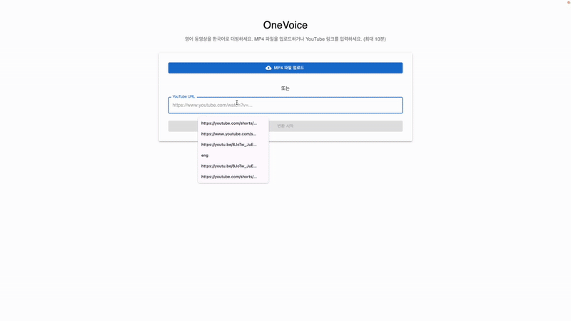

# OneVoice



OneVoice는 영어 동영상을 한국어로 자동 더빙하는 웹 애플리케이션입니다. YouTube 링크나 MP4 파일을 업로드하여 음성을 번역하고 더빙할 수 있습니다.

## 기능

- 로컬 MP4 비디오 파일 업로드 및 처리
- YouTube 영상 URL 입력으로 처리
- 영어 오디오 추출 및 음성-텍스트 변환(STT)
- 영어에서 한국어로 텍스트 번역
- 한국어 텍스트를 음성으로 변환(TTS)
- 원본 영상에 번역된 한국어 음성 합성
- 작업 진행 상태 실시간 모니터링
- 결과 비디오 다운로드 기능

## 기술 스택

### 백엔드
- **Python**: 주요 백엔드 로직 구현
- **FastAPI**: RESTful API 서버
- **Google Cloud Platform**:
  - Speech-to-Text API: 음성 인식
  - Translation API: 텍스트 번역
  - Text-to-Speech API: 음성 합성
- **FFmpeg**: 오디오/비디오 처리
- **Redis**: 작업 상태 및 메타데이터 저장
- **yt-dlp**: YouTube 비디오 다운로드

### 프런트엔드
- **React**: 사용자 인터페이스 구축
- **TypeScript**: 타입 안정성 향상
- **Material-UI**: UI 컴포넌트 및 스타일링
- **React Router**: 클라이언트 사이드 라우팅

### 인프라
- **Docker**: 애플리케이션 컨테이너화
- **Docker Compose**: 멀티 컨테이너 애플리케이션 오케스트레이션
- **Google Cloud Storage**: 처리된 미디어 파일 저장

## 시스템 아키텍처

OneVoice는 다음과 같은 주요 컴포넌트로 구성됩니다:

1. **프론트엔드**: 사용자 인터페이스와 인터랙션 처리
2. **백엔드 API**: 파일 업로드, 처리 작업 조정, 상태 제공
3. **작업 관리자**: 비동기 작업 처리 및 상태 추적
4. **미디어 프로세서**: 오디오/비디오 추출 및 합성
5. **AI 서비스 래퍼**: Google Cloud API 통합

처리 파이프라인:
```
업로드/YouTube 링크 → 비디오 다운로드 → 오디오 추출 → 
STT → 텍스트 번역 → TTS → 오디오/비디오 합성 → 결과물
```

## 설치 및 실행

### 전제 조건
- Docker 및 Docker Compose 설치
- Google Cloud Platform 계정 및 API 사용 설정
- GCP 서비스 계정 키(JSON)

### 환경 설정
1. 리포지토리 클론
```bash
git clone https://github.com/your-username/onevoice.git
cd onevoice
```

2. 환경 변수 설정
`.env` 파일을 루트 디렉토리에 생성하고 다음 변수를 설정합니다:
```
GOOGLE_CLOUD_PROJECT_ID=your-project-id
GOOGLE_CLOUD_LOCATION=global
```

3. GCP 서비스 계정 키 파일을 `backend/credentials.json`으로 저장

### 애플리케이션 실행
```bash
docker-compose up --build
```

애플리케이션은 다음 주소에서 접근할 수 있습니다:
- 프론트엔드: http://localhost
- 백엔드 API: http://localhost:8000

## 프로젝트 구조

```
onevoice/
├── frontend/               # 리액트 프론트엔드
│   ├── src/
│   │   ├── components/     # 리액트 컴포넌트
│   │   ├── api/            # API 클라이언트
│   │   └── utils/          # 유틸리티 함수
│   ├── Dockerfile          # 프론트엔드 도커 이미지 정의
│   └── nginx.conf          # Nginx 설정
├── backend/                # 백엔드 API 서버
│   ├── src/
│   │   ├── routes/         # API 엔드포인트
│   │   ├── services/       # 비즈니스 로직
│   │   └── tests/          # 테스트
│   ├── Dockerfile          # 백엔드 도커 이미지 정의
│   └── credentials.json    # GCP 서비스 계정 키 (추가 필요)
└── docker-compose.yml      # 컨테이너 설정
```

## 제한 사항

- 현재 10분 이하 길이의 비디오만 처리 가능
- 주요 언어는 영어(원본)에서 한국어(번역)로 제한
- 처리 성능은 GCP API 제한 및 서버 성능에 의존

## 라이센스

[MIT License](LICENSE) 